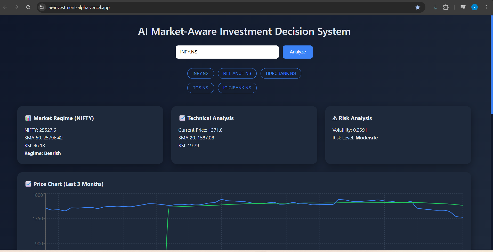
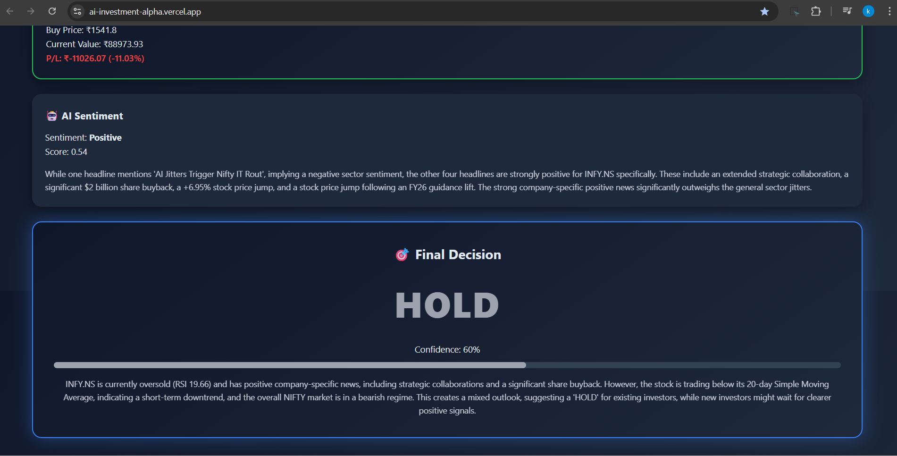

# 🚀 AI Market-Aware Investment Decision System

An AI-powered full-stack investment analysis platform that combines 
technical indicators, risk analysis, sentiment analysis, and market regime detection 
using a LangChain multi-agent architecture.

🌐 Live Demo: https://ai-investment-alpha.vercel.app/  
⚡ Backend API: https://ai-investment.onrender.com/docs  

---

## 📌 Project Overview

This system analyzes Indian stock market data and generates intelligent 
BUY / SELL / HOLD decisions using:

- Technical Indicators (SMA, RSI)
- Volatility-based Risk Analysis
- News Sentiment Analysis
- Overall Market Regime (NIFTY)
- LangChain Tool-Based Multi-Agent Orchestration

The frontend provides interactive visualization and portfolio simulation.

---

## 🧠 Architecture

Frontend (React + Vercel)  
⬇  
Backend API (FastAPI + LangChain)  
⬇  
AI Tools:
- Market Analysis Tool
- Risk Tool
- Sentiment Tool
- Market Regime Tool  
⬇  
LLM Decision Engine (Google Gemini)

---

## ⚙️ Tech Stack

### Frontend
- React (Vite)
- Recharts (Interactive Charts)
- Responsive UI
- Deployed on Vercel

### Backend
- FastAPI
- LangChain (Tool-Based Agent System)
- Google Gemini API
- Pandas & yFinance
- Docker (Containerized)
- CORS Handling
- Deployed on Render

### Cloud & DevOps
- Docker Containerization
- AWS EC2 (Initial Deployment)
- Amazon ECR (Container Registry)
- Render (Final Production Deployment)
- Vercel (Frontend Hosting)
- Git & GitHub

---

## 🧩 Features

### 📊 Technical Analysis
- 20-day SMA
- RSI (14)
- Price trend visualization
- 3-month historical price chart

### ⚠ Risk Analysis
- Volatility calculation
- Risk classification (Low / Moderate / High)

### 📰 Sentiment Analysis
- News-based sentiment scoring
- Mixed / Positive / Negative classification

### 📈 Market Regime Detection
- NIFTY Index monitoring
- Bullish / Bearish classification

### 💼 Portfolio Simulation
- Simulated ₹1,00,000 investment
- Share calculation
- Profit / Loss
- Return %

### 🤖 AI Decision Engine
- LangChain multi-tool orchestration
- LLM-driven structured decision
- Confidence score
- Explanation reasoning

---

## 🐳 Docker Setup

Build Docker Image:

```bash
docker build -t ai-investment-backend .
```

Run Container:

```bash
docker run -p 8000:8000 --env-file .env ai-investment-backend
```

---

## ☁ Cloud Deployment Journey

### Phase 1: AWS Deployment
- Created Docker image
- Pushed to Amazon ECR
- Launched EC2 instance
- Configured security groups
- Deployed container on EC2

### Phase 2: Production Optimization
- Migrated backend to Render for HTTPS support
- Deployed frontend to Vercel
- Integrated frontend & backend securely
- Solved Mixed Content HTTPS issues

---

## 🔗 API Endpoint

```
GET /analyze/{symbol}
```

Example:

```
/analyze/INFY.NS
```

Returns structured JSON:

```json
{
  "action": "BUY",
  "confidence": 78,
  "reasoning": "Short explanation..."
}
```

---

## 📷 Screenshots

### Dashboard View


### Price Chart


### AI Decision Output



---

## 🎯 What This Project Demonstrates

- Multi-Agent AI system design
- LangChain tool orchestration
- Full-stack architecture
- Cloud deployment experience
- Docker containerization
- AWS EC2 & ECR usage
- HTTPS & CORS debugging
- Production migration strategy

---

## 👩‍💻 Author

Ashritha  
Aspiring AI Engineer 

